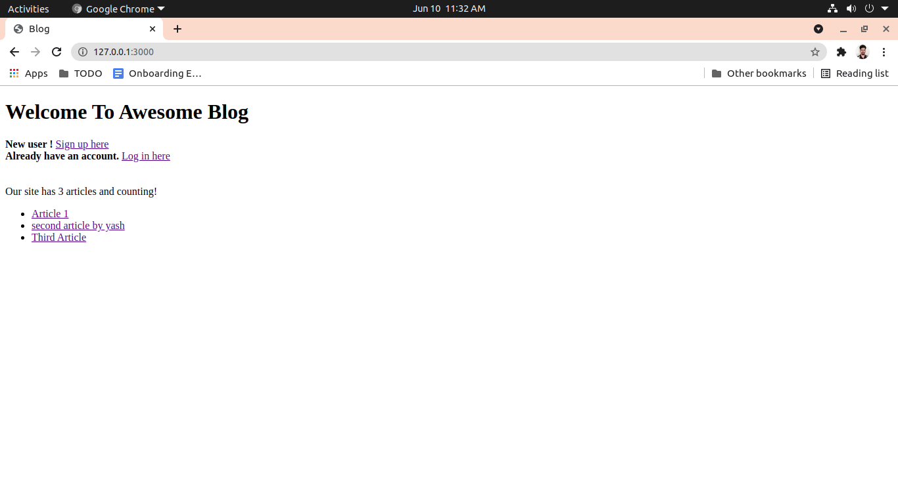
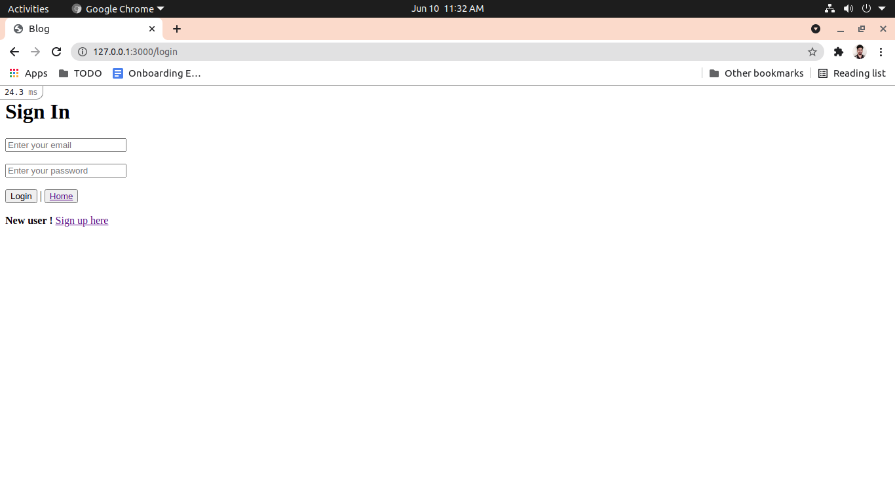
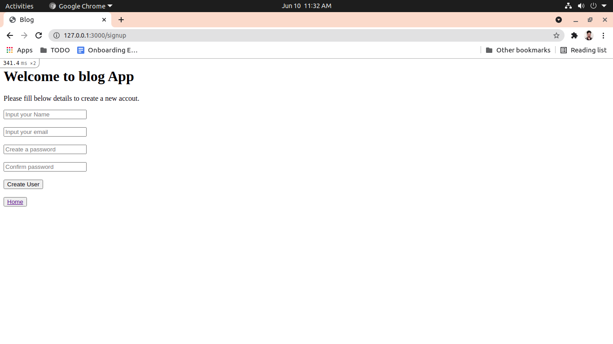
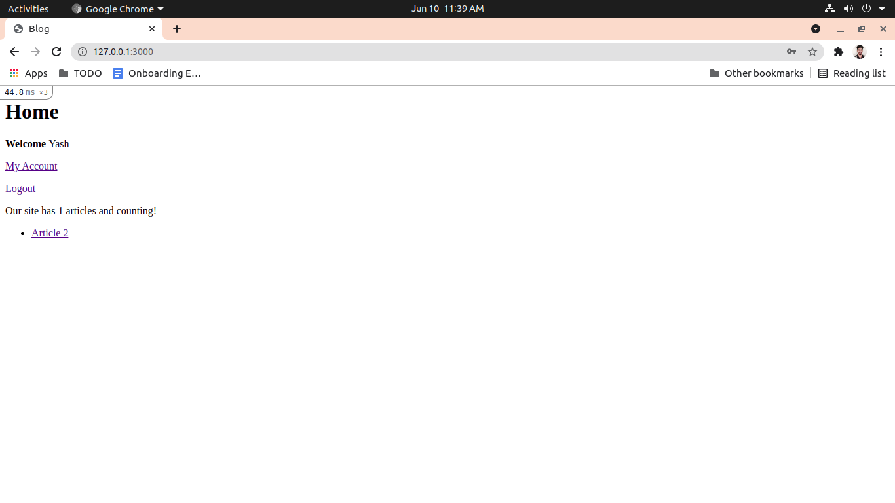
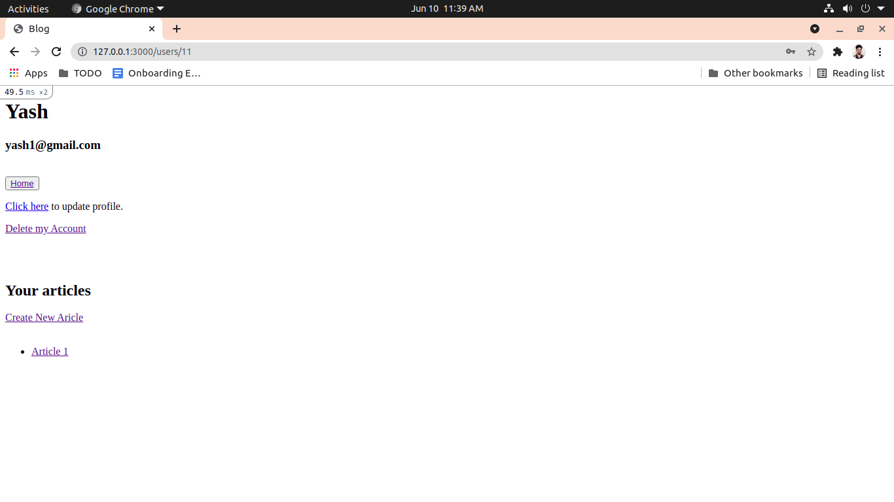
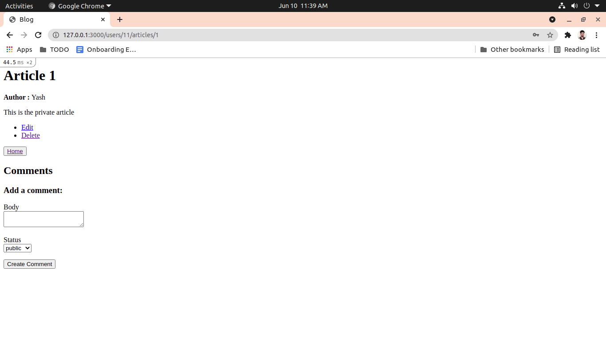
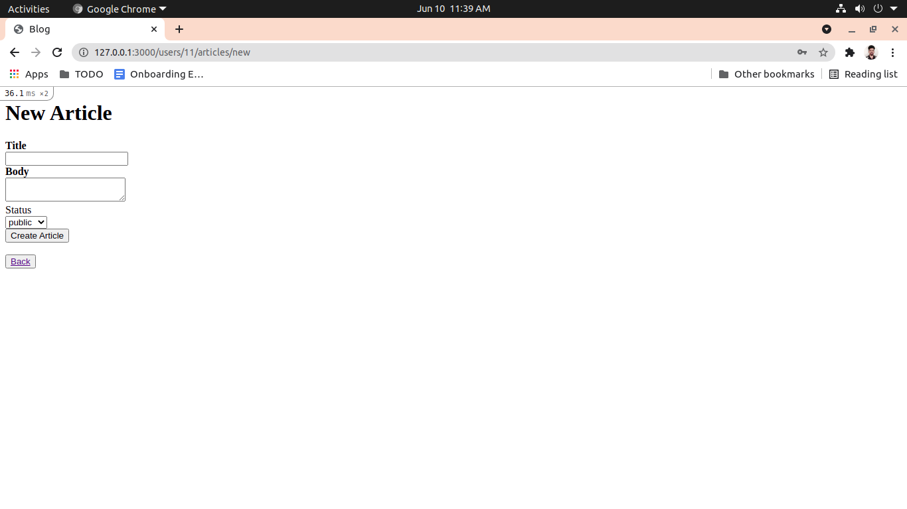
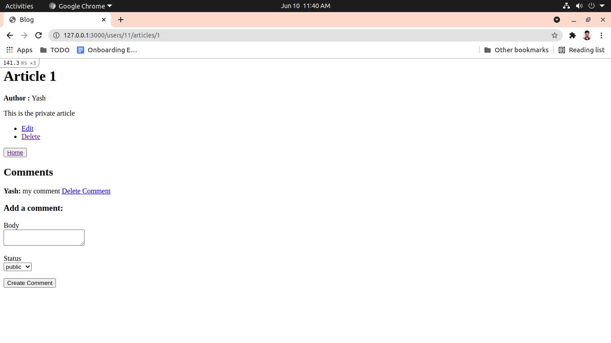

# README

<h1> Routes </h1>

<strong>home         => </strong> http://127.0.0.1:3000/

<strong>signup       => </strong> http://127.0.0.1:3000/signup

<strong>login        => </strong> http://127.0.0.1:3000/login

<strong>user         => </strong> http://127.0.0.1:3000/user/:id

<strong>new user     => </strong> http://127.0.0.1:3000/user/new

<strong>edit user    => </strong> http://127.0.0.1:3000/user/:id/edit

<strong>article      => </strong> http://127.0.0.1:3000/user/:user_id/articles/:id

<strong>new article  => </strong> http://127.0.0.1:3000/user/:user_id/articles/new

<strong>edit article => </strong> http://127.0.0.1:3000/user/:user_id/articles/:id/edit

<strong>new comments => </strong> http://127.0.0.1:3000/user/:user_id/articles/:article_id/comments/new

<strong>edit comments=> </strong> http://127.0.0.1:3000/user/:user_id/articles/:article_id/comments/:id/edit

<h1>Attached Screen shots</h1>

Home Page 
 

Login Page 
 

Sign Up Page 
 

Home User Page 
 

My Account Page 
 

Article Page 
 

New Article Page 
 

Comments Page 
 